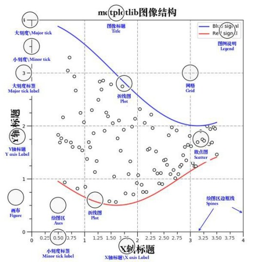
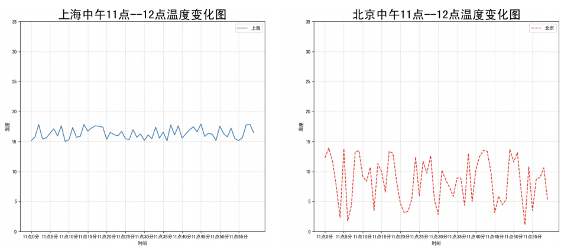
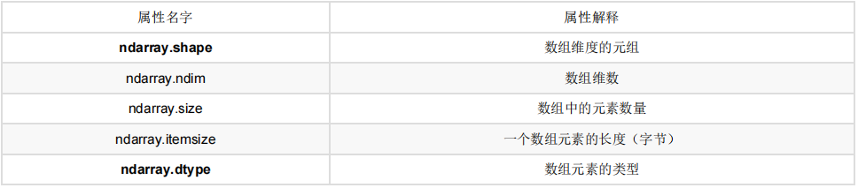

* virtualenv和virtualenvwrapper

  virtualenv 可以在系统中建立多个不同并且相互不干扰的虚拟环境。另外，值得一提的是，在 virtualenv 的虚拟环境中使用 pip 安装依赖还可以绕过某些系统的权限设置，因为毕竟不需要向系统目录写入数据，virtualenv 的一个最大的缺点就是，每次开启虚拟环境之前要去虚拟环境所在目录下的 bin 目录下 source 一下 activate，这就需要我们记住每个虚拟环境所在的目录。一种可行的解决方案是，将所有的虚拟环境目录全都集中起来，比如放到 ~/virtualenvs/，并对不同的虚拟环境使用不同的目录来管理。virtualenvwrapper 正是这样做的。并且，它还省去了每次开启虚拟环境时候的 source 操作，使得虚拟环境更加好用。使用步骤：

  ```shell
  pip install virtualenv
  
  pip install virtualenvwrapper
  
  export WORKON_HOME='~/.virtualenvs'
  export  VIRTUALENVWRAPPER_PYTHON=/usr/bin/python3
  export VIRTUALENVWRAPPER_VIRTUALENV=~/.local/bin/virtualenv
  source ~/.local/bin/virtualenvwrapper.sh
  # 利用 virtualenvwrapper，我们可以使用下面的命令轻松创建一个虚拟环境。
  mkvirtualenv spider
  # 如果我们平时想要进入某个虚拟环境，可以用下面的命令。
  workon spider
  # 离开虚拟环境，可以使用。
  deactivate
  # 删除虚拟环境也一样简单。
  rmvirtualenv spider
  ```

* Jupyter Notebook

  是一个ipython的web加强版，保存文件是.ipynb，每个内容,都对应的是一个cell，使用：

  ```shell
  # 进入虚拟环境 
  workon ai 
  # 输入命令，本地notebook的默认URL为：http://localhost:8888
  jupyter notebook
  # 安装jupyter_contrib_nbextensions库
  pip install jupyter_contrib_nbextensions
  jupyter contrib nbextension install --user --skip-running-check
  ```

* matplotlib

  专门用于开发2D(3D)图表的包 绘制图像流程

  1. 创建画布 -- plt.figure(figsize=(20,8)) 
  2. 绘制图像 -- plt.plot(x, y) 
  3. 显示图像 -- plt.show()

	添加x,y轴刻度：plt.xticks() plt.yticks() ，注意:在传递进去的第一个参数必须是数字,不能是字符串,如果是字符串吗,需要进行替换操作 
	
	添加网格显示：plt.grid(linestyle="--", alpha=0.5) 
	
	添加描述信息：plt.xlabel() plt.ylabel() plt.title() 
	
	图像保存：plt.savefig("路径") 
	
	多次plot：直接进行添加就OK 
	
	显示图例：plt.legend(loc="best")，注意:一定要在plt.plot()里面设置一个label,如果不设置,没法显示 
	
	多个坐标系显示：plt.subplots(nrows=, ncols=) 
	
	```python
	import matplotlib.pyplot as plt 
	import random 
	# 0.准备数据 
	x = range(60) 
	y_shanghai = [random.uniform(15, 18) for i in x] 
	y_beijing = [random.uniform(1, 5) for i in x] 
	# 1.创建画布 
	# plt.figure(figsize=(20, 8), dpi=100) 
	fig, axes = plt.subplots(nrows=1, ncols=2, figsize=(20, 8), dpi=100) 
	# 2.绘制图像 
	# plt.plot(x, y_shanghai, label="上海") 
	# plt.plot(x, y_beijing, color="r", linestyle="--", label="北京") 
	axes[0].plot(x, y_shanghai, label="上海") axes[1].plot(x, y_beijing, color="r", linestyle="--", label="北京") 
	# 2.1 添加x,y轴刻度 
	# 构造x,y轴刻度标签 
	x_ticks_label = ["11点{}分".format(i) for i in x] 
	y_ticks = range(40) 
	# 刻度显示 
	# plt.xticks(x[::5], x_ticks_label[::5]) 
	# plt.yticks(y_ticks[::5]) axes[0].set_xticks(x[::5]) 
	axes[0].set_yticks(y_ticks[::5]) 
	axes[0].set_xticklabels(x_ticks_label[::5]) 
	axes[1].set_xticks(x[::5]) 
	axes[1].set_yticks(y_ticks[::5]) 
	axes[1].set_xticklabels(x_ticks_label[::5]) 
	# 2.2 添加网格显示 
	# plt.grid(True, linestyle="--", alpha=0.5) 
	axes[0].grid(True, linestyle="--", alpha=0.5) 
	axes[1].grid(True, linestyle="--", alpha=0.5) 
	# 2.3 添加描述信息 
	# plt.xlabel("时间") 
	# plt.ylabel("温度") 
	# plt.title("中午11点--12点某城市温度变化图", fontsize=20) 
	axes[0].set_xlabel("时间") 
	axes[0].set_ylabel("温度") 
	axes[0].set_title("中午11点--12点某城市温度变化图", fontsize=20) 
	axes[1].set_xlabel("时间") 
	axes[1].set_ylabel("温度") 
	axes[1].set_title("中午11点--12点某城市温度变化图", fontsize=20) 
	# # 2.4 图像保存 
	plt.savefig("./test.png") 
	# # 2.5 添加图例 
	# plt.legend(loc=0) axes[0].legend(loc=0) 
	axes[1].legend(loc=0) 
	# 3.图像显示 
	plt.show()
	```

​		折线图：plt.plot() 

​		散点图：plt.scatter() 

​		柱状图：plt.bar(x, width, align="center") 

​		直方图：plt.hist(x, bins) 

​		饼图：plt.pie(x, labels, autopct, colors)

* Numpy

  NumPy提供了一个N维数组类型ndarray，它描述了相同类型的“items”的集合。生成numpy对象:np.array() 。ndarray支持并行化运算（向量化运算） ndarray底层是用C语言写的,效率更高,释放了GIL（全局解释器锁），其对数组的操作速度不受Python解释器的限制，所以，其效率远高于纯 Python代码

  

  创建数组：生成0和1的数组 np.ones() np.ones_like() 

  从现有数组中生成：np.array -- 深拷贝 np.asarray -- 浅拷贝 

  生成固定范围数组：np.linspace() 生成等间隔的多少个 np.arange() 每间隔多少生成数据 np.logspace() 生成以10的N次幂的数据 

  生层随机数组：np.random()；正态分布np.random.randn() np.random.normal(0, 1, 100)；均匀分布np.random.rand() np.random.uniform(0, 1, 100) np.random.randint(0, 10, 10) 

  数组索引：直接进行索引,切片 对象[:, :] -- 先行后列 

  数组形状改变：对象.reshape() 没有进行行列互换,新产生一个ndarray；对象.resize() 没有进行行列互换,修改原来的ndarray；对象.T 进行转置行列互换

  数组类型修改：ndarray.astype(type) 返回修改了类型之后的数组；ndarray.tostring([order])或者ndarray.tobytes([order]) 构造包含数组中原始数据字节的Python字节

  数组去重：np.unique(对象)

  逻辑运算：直接进行大于,小于的判断 合适之后,可以直接进行赋值 

  通用判断函数：np.all() np.any() 

  复合逻辑：np.where() np.logical_and和np.logical_or

  统计运算：np.max()；np.min()；np.median()；np.mean()；np.std()；np.var()；np.argmax(axis=)—最大元素对应的下标；np.argmin(axis=)—最小元素对应的下标

  数组运算,满足广播机制其中之一就OK：1.维度相等 2.shape(其中对应的地方为1,也是可以的)

  矩阵运算：np.matmul np.dot 注意：二者都是矩阵乘法。 np.matmul中禁止矩阵与标量的乘法。 在矢量乘矢量的內积运算中，np.matmul与np.dot没有区别。

* Pandas：封装了Matplotlib、Numpy的画图和计算

  series：创建pd.Series([], index=[]) ；pd.Series({}) 对象.index 对象.values 

  DataFrame：创建pd.DataFrame(data=None, index=None, columns=None) ；属性：shape -- 形状，index -- 行索引，columns -- 列索引，values -- 查看值，T -- 转置，head() -- 查看头部内容，tail() -- 查看尾部内容；DataFrame索引修改的时候,需要进行全局修改，对象.reset_index()，对象.set_index(keys) 

  MultiIndex与Panel：multiIndex类似ndarray中的三维数组 创建：pd.MultiIndex.from_arrays()；属性：对象.index；panel：pd.Panel(data, items, major_axis, minor_axis) panel数据要是想看到,则需要进行索引到dataframe或者series才可以；Pandas从版本0.20.0开始弃用：推荐的用于表示3D数据的方法是通过DataFrame上的MultiIndex方法

  索引：直接索引 -- 先列后行,是需要通过索引的字符串进行获取；loc -- 先行后列,是需要通过索引的字符串进行获取；iloc -- 先行后列,是通过下标进行索引；ix -- 先行后列, 可以用上面两种方法混合进行索引

  赋值：data["xxx"] = ** data.xxx = 

  排序：dataframe对象.sort_values()；对象.sort_index()；series对象.sort_values()；对象.sort_index()

  算术运算：add和sub

  逻辑运算：1.逻辑运算符号；2.逻辑运算函数：对象.query() 对象.isin() 

  统计运算：1.对象.describe()；2.统计函数；3.累积统计函数；

  自定义运算：apply(func, axis=0) func:自定义函数 axis=0:默认是列，axis=1为行进行运算

  DataFrame的画图函数pandas.DataFrame.plot；Series的画图函数pandas.Series.plot

  文件读取与存储：CSV：read_csv和to_csv；HDF5：read_hdf与to_hdf；JSON：read_json和to_json

  高级处理-缺失值处理：isnull、notnull判断是否存在缺失值：np.any(pd.isnull(movie)) # 里面如果有一个缺失值,就返回True，np.all(pd.notnull(movie)) # 里面如果有一个缺失值,就返回False；dropna删除：使用dropna的前提是，缺失值的类型必须是np.nan，movie.dropna()；fillna填充缺失值：movie[i].fillna(value=movie[i].mean(), inplace=True)；replace替换具体某些值：wis.replace(to_replace="?", value=np.NaN)

  高级处理-数据离散化：qcut、cut实现数据分组：qcut:大致分为相同的几组，cut:自定义分组区间；get_dummies实现哑变量矩阵

  高级处理-合并：pd.concat([数据1, 数据2], axis=**)；pd.merge(left, right, how=, on=)：how -- 以何种方式连接，on -- 连接的键的依据是哪几个

  高级处理-交叉表crosstab与透视表pivot_table：交叉表与透视表的作用：交叉表计算一列数据对于另外一列数据的分组个数，透视表指定某一列对另一列的关系

  高级处理-分组与聚合：groupby

* Seaborn：基于 Matplotlib核心库进行了更高级的API封装，可以轻松地画出更漂亮的图形，而Seaborn的漂亮主要体现在配色更加舒服，以及图 形元素的样式更加细腻。

  绘制单变量分布图形seaborn.distplot()；绘制双变量分布图形seaborn.jointplot()；绘制成对的双变量分布图形Seaborn.pairplot()

  类别散点图 seaborn.stripplot()；类别内的数据分布：箱线图seaborn.boxplot()，小提琴图seaborn.violinplot()；类别内的统计估计：条形图barplot()，点图pointplot()

  