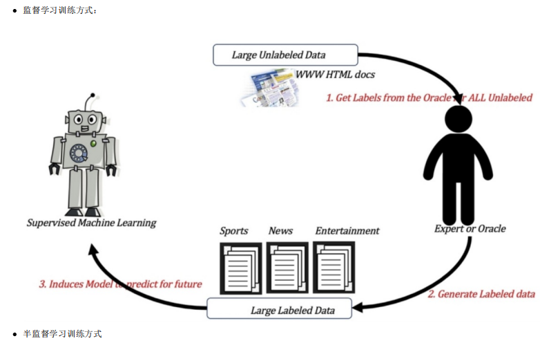
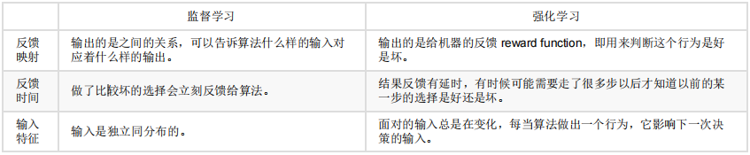

* 机器学习的方法包括:

  * 监督学习 supervised learning：有数据和标签
  * 非监督学习 unsupervised learning：只有数据没有标签
  * 半监督学习 semi-supervised learning：结合监督学习和非监督学习
  * 强化学习 reinforcement learning：从经验中总结提升
  * 遗传算法 genetic algorithm：适者生存，不适者淘汰

  监督学习学的是如何分析信息，而生成模型想要解决的是怎么输出信息。
=======
* 人工智能的起源

  * 图灵测试

    测试者与被测试者（一个人和一台机器）隔开的情况下，通过一些装置（如键盘）向被测试者随意提问。多次测试（一般为5min之内），如果有超过30%的测试者不能确定被测试者是人还是机器，那么这台机器就通过了测试，并被认为具有人类智 能。

  * 达特茅斯会议：1956年人工智能元年。

* 人工智能的发展经历了六个阶段

  

* 人工智能主要分支

  * 计算机视觉(CV) 

    这一技术类别中的经典任务有图像形成、图像处理、图像提取和图像的三维推理。物体检测和人脸 识别是其比较成功的研究领域。但是，这项技术离社会影响阶段还有一定距离，那要等到机器能在所有场景中都达到人类的同等水平才行(感知其环境的 所有相关方面)。

    

  * 自然语言处理(NLP)

    * 语音识别

      语音识别是指识别语音(说出的语言)并将其转换成对应文本的技术。相反的任务(文本转语音/TTS)也是这一领域内一个类似的研究主题。语音识别领域仍然面临着声纹识别和「鸡尾酒会效应」等一些特殊情况的难题。 现代语音识别系统严重依赖于云，在离线时可能就无法取得理想的工作效果。

      

    * 文本挖掘/分类

      这里的文本挖掘主要是指文本分类，该技术可用于理解、组织和分类结构化或非结构化文本文档。其涵盖的主要任务有句法分析、情绪分析 和垃圾信息检测。文本挖掘和分类领域的一个瓶颈出现在歧义和有偏差的数据上。

      

    * 机器翻译 

      机器翻译(MT)是利用机器的力量自动将一种自然语言(源语言)的文本翻译成另一种语言(目标语言)。在某些情况下，俚语和行话等内容的翻译会比较困难(受限词表问题)。 专业领域的机器翻译(比如医疗领域)表现通常不好。

      

  * 机器人

    机器人学(Robotics)研究的是机器人的设计、制造、运作和应用，以及控制它们的计算机系统、传感反馈和信息处理。

    

* 机器学习

  机器学习是从数据中自动分析获得模型，并利用模型对未知数据进行预测。

  * 工作流程

    

    1. 获取数据 

       

       在数据集中一般：一行数据我们称为一个样本；一列数据我们成为一个特征；有些数据有目标值(标签值)，有些数据没有目标值(如上表中，电影类型就是这个数据集的目标值)

       数据类型构成：1. 特征值+目标值(目标值是连续的和离散的)；2.只有特征值，没有目标值

       数据分割： 机器学习一般的数据集会划分为两个部分

       * 训练数据：用于训练，构建模型(70% 80% 75%)
       * 测试数据：在模型检验时使用，用于评估模型是否有效(30% 20% 25%)

    2. 数据基本处理 ：对数据进行缺失值、去除异常值等处理

    3. 特征工程 

       特征工程是使用专业背景知识和技巧处理数据，使得特征能在机器学习算法上发挥更好的作用的过程。 意义：会直接影响机器学习的效果。机器学习领域的大神Andrew Ng(吴恩达)老师说“Coming up with features is difficult, time-consuming, requires expert knowledge. “Applied machine learning” is basically feature engineering. ” (注：业界广泛流传：数据和特征决定了机器学习的上限，而模型和算法只是逼近这个上限而已)

       * 特征提取

         将任意数据（如文本或图像）转换为可用于机器学习的数字特征

         

       * 特征预处理

         通过一些转换函数将特征数据转换成更加适合算法模型的特征数据过程

         

       * 特征降维

         指在某些限定条件下，降低随机变量(特征)个数，得到一组“不相关”主变量的过程

         

       

    4. 机器学习(模型训练) ：选择合适的算法对模型进行训练

       根据数据集组成不同，可以把机器学习算法分为

       

       * 监督学习

         输入数据是由输入特征值和目标值所组成。 函数的输出可以是一个连续的值(称为回归）， 或是输出是有限个离散值（称作分类）。

       * 无监督学习

         输入数据是由输入特征值组成，没有目标值 输入数据没有被标记，也没有确定的结果。样本数据类别未知； 需要根据样本间的相似性对样本集进行类别划分。

         

       * 半监督学习

         训练集同时包含有标记样本数据和未标记样本数据。

         

         

       * 强化学习

         实质是make decisions 问题，即自动进行决策，并且可以做连续决策。

         举例： 小孩想要走路，但在这之前，他需要先站起来，站起来之后还要保持平衡，接下来还要先迈出一条腿，是左腿还是右腿，迈出一步后还要迈出 下一步。 小孩就是 agent，他试图通过采取行动（即行走）来操纵环境（行走的表面），并且从一个状态转变到另一个状态（即他走的每一步），当他 完成任务的子任务（即走了几步）时，孩子得到奖励（给巧克力吃），并且当他不能走路时，就不会给巧克力。 主要包含五个元素：agent, action, reward, environment, observation；

         强化学习的目标就是获得最多的累计奖励。监督学习和强化学习的对比：

         

    5. 模型评估：对训练好的模型进行评估

       模型评估是模型开发过程不可或缺的一部分。它有助于发现表达数据的最佳模型和所选模型将来工作的性能如何。 

       * 分类模型评估

         准确率：预测正确的数占样本总数的比例。 其他评价指标：精确率、召回率、F1-score、AUC指标等

       * 回归模型评估

         RMSE -- 均方根误差

       * 拟合

         * 欠拟合：学习到的东西太少 模型学习的太过粗糙
         * 过拟合：学习到的东西太多 学习到的特征多，不好泛化

* 深度学习

  深度学习（Deep Learning）（也称为深度结构学习【Deep Structured Learning】、层次学习【Hierarchical Learning】或者是深度机器学习 【Deep Machine Learning】）是一类算法集合，是机器学习的一个分支。深度学习的发展源头--神经网络，多层神经网络，在最初几层是识别简单内容，后面几层是识别一些复杂内容。
