* Scikit-learn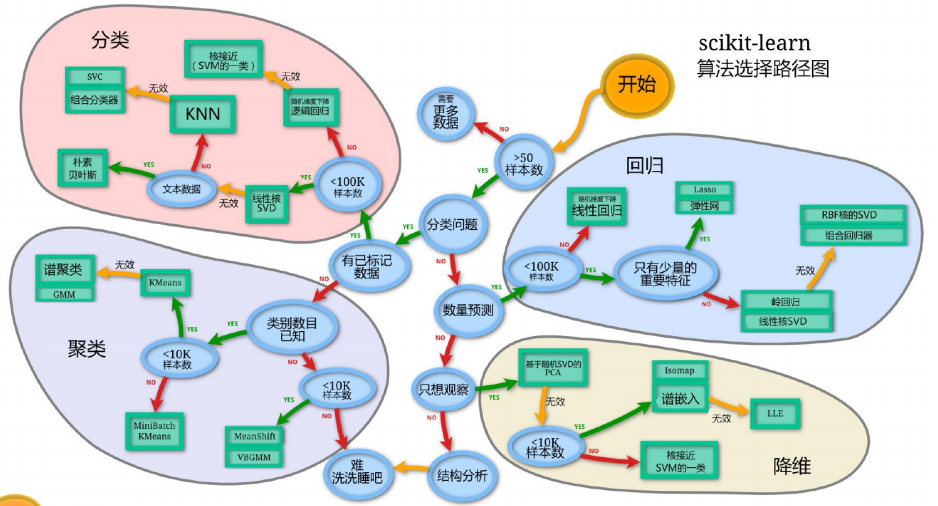

  ```shell
  pip3 install scikit-learn
  # 安装好之后可以通过以下命令查看是否安装成功 
  import sklearn
  ```

* K-近邻算法(KNN)

  K Nearest Neighbor算法又叫KNN算法，如果一个样本在特征空间中的k个最相似(即特征空间中最邻近)的样本中的大多数属于某一个类别，则该样本也属于这个类别。

  KNN算法流程总结：1）计算已知类别数据集中的点与当前点之间的距离；2）按距离递增次序排序 ；3）选取与当前点距离最小的k个点；4）统计前k个点所在的类别出现的频率；5）返回前k个点出现频率最高的类别作为当前点的预测分类

  sklearn.neighbors.KNeighborsClassifier(n_neighbors=5)，n_neighbors：int,可选(默认= 5)，k_neighbors查询默认使用的邻居数

  距离公式：在机器学习过程中，对于函数 dist(., .)，若它是"距离度量" (distance measure)，则需满足以下这些基本性质: 非负性： dist(Xi, Xj) >= 0 ； 同一性：dist(xi, xj) = 0。当且仅当 Xi = Xj ； 对称性： dist(xi, xj) = dist(xj , xi)； 直递性： dist(xi, xj) <= dist(xi, xk) + dist(xk, xj)

  常见距离公式

  1. 欧式距离(Euclidean Distance)：通过距离平方值进行计算
  2. 曼哈顿距离(Manhattan Distance)：通过距离的绝对值进行计算
  3. 切比雪夫距离 (Chebyshev Distance)： 维度的最大值进行计算
  4. 闵可夫斯基距离(Minkowski Distance)：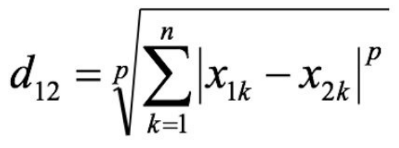 当p=1时，就是曼哈顿距离； 当p=2时，就是欧式距离； 当p→∞时，就是切比雪夫距离。

  连续属性和离散属性：存在序关系，可以将其转化为连续值；不存在序关系，通常将其转化为向量的形式

  KNN中K值大小选择对模型的影响：K值过小：容易受到异常点的影响，容易过拟合；k值过大：受到样本均衡的问题，容易欠拟合

  近似误差： 对现有训练集的训练误差，关注训练集， 如果近似误差过小可能会出现过拟合的现象，对现有的训练集能有很好的预测，但是对未知的测试样本将会出现较大偏差的预测，模型本身不是最接近最佳模型；估计误差：可以理解为对测试集的测试误差，关注测试集， 估计误差小说明对未知数据的预测能力好， 模型本身最接近最佳模型。

  kd树：为了避免每次都重新计算一遍距离，算法会把距离信息保存在一棵树里，这样在计算之前从树里查询距离信息， 尽量避免重新计算。其基本原理是，如果A和B距离很远，B和C距离很近，那么A和C的距离也很远。有了这个信息， 就可以在合适的时候跳过距离远的点。

  kd树(K-dimension tree)是一种对k维空间中的实例点进行存储以便对其进行快速检索的树形数据结构。kd树是一种二叉 树，表示对k维空间的一个划分，构造kd树相当于不断地用垂直于坐标轴的超平面将K维空间切分，构成一系列的K维超 矩形区域。kd树的每个结点对应于一个k维超矩形区域。利用kd树可以省去对大部分数据点的搜索，从而减少搜索的计算量

  kd树的构建过程

  需要关注细节：a.选择向量的哪一维进行划分；b.如何划分数据 

  1. 构造根节点
  2. 通过递归的⽅法，不断地对k维空间进行切分，生成子节点
  3. 重复第2步骤，直到子区域中没有示例时终止

  kd树的搜索过程

  1. 二叉树搜索比较待查询节点和分裂节点的分裂维的值，（小于等于就进入左子树分支，大于就进入右子树分支直到叶子结点）
  2. 顺着“搜索路径”找到最近邻的近似点
  3. 回溯搜索路径，并判断搜索路径上的结点的其他子结点空间中是否可能有距离查询点更近的数据点，如果有 可能，则需要跳到其他子结点空间中去搜索 
  4. 重复这个过程直到搜索路径为空

  获取数据集：小数据: sklearn.datasets.load\_\*；大数据集: sklearn.datasets.fetch_*

  数据集返回值介绍：返回值类型是bunch--是一个字典类型；返回值的属性: data：特征数据数组；target：标签(目标)数组；DESCR：数据描述；feature_names：特征名；target_names：标签(目标值)名

  数据集的划分：sklearn.model_selection.train_test_split(arrays, *options) 参数:x -- 特征值；y -- 目标值；test_size -- 测试集大小；ramdom_state -- 随机数种子；返回值: x_train, x_test,y_train, y_test

  特征工程：定义通过一些转换函数将特征数据转换成更加适合算法模型的特征数据过程

  * 归一化：对原始数据进行变换把数据映射到(默认为[0,1])之间

    api: sklearn.preprocessing.MinMaxScaler (feature_range=(0,1)… ) 参数:feature_range -- 自己指定范围,默认0-1 总结:鲁棒性比较差(容易受到异常点的影响) 只适合传统精确小数据场景(以后不会用你了)

  * 标准化：对原始数据进行变换把数据变换到均值为0,标准差为1范围内

    api: sklearn.preprocessing.StandardScaler( ) 总结:异常值对我影响小 适合现代嘈杂大数据场景(以后就是用你了)

  sklearn.neighbors.KNeighborsClassifier(n_neighbors=5,algorithm='auto') n_neighbors： int,可选（默认= 5），k_neighbors查询默认使⽤的邻居数 algorithm：{‘auto’，‘ball_tree’，‘kd_tree’，‘brute’} 快速k近邻搜索算法，默认参数为auto，可以理解为算法自己决定合适的搜索算法。除此之外，用户也可以自己指定搜索算法ball_tree、kd_tree、brute方法进行搜索， brute是蛮力搜索，也就是线性扫描，当训练集很大时，计算非常耗时。kd_tree，构造kd树存储数据以便对其进行快速检索的树形数据结构，kd树也就是数据结构中的二叉树。以中值切分构造的树，每个结点是一个超矩形，在维数小于20时效率高。 ball tree是为了克服kd树⾼维失效而发明的，其构造过程是以质心C和半径r分割样本空间，每个节点一个超球体。

  k近邻算法优缺点

  * 优点：简单有效；重新训练的代价低；适合类域交叉样本，KNN方法主要靠周围有限的邻近的样本,而不是靠判别类域的方法来确定所属类别的，因此对于类域的交叉或重叠较多的待分样本集来说，KNN方法较其他方法更为适合；适合大样本自动分类，该算法比较适用于样本容量比较大的类域的自动分类，而那些样本容量较小的类域采用这种算法比较容易产生误分。
  * 缺点：惰性学习KNN，算法是懒散学习方法（lazy learning,基本上不学习），一些积极学习的算法要快很多；类别评分不是规格化，不像一些通过概率评分的分类；输出可解释性不强，例如决策树的输出可解释性就较强；对不均衡的样本不擅长，当样本不平衡时，如一个类的样本容量很大，而其他类样本容量很小时，有可能导致当输入一个新样本时，该样本的K个邻居中大容量类的样本占多数，该算法只计算“最近的”邻居样本，某一类的样本数量很大，那么或者这类样本并不接近目标样本，或者这类样本很靠近目标样本，无论怎样，数量并不能影响运行结果，可以采用权值的方法（和该样本距离小的邻居权值大）来改进；计算量较大，目前常用的解决方法是事先对已知样本点进行剪辑，事先去除对分类作用不大的样本。

  交叉验证：将拿到的训练数据，分为训练和验证集，几折交叉验证；分割方式：训练集：训练集+验证集，测试集：测试集；为什么需要交叉验证？为了让被评估的模型更加准确可信，注意：交叉验证不能提高模型的准确率

  网格搜索：超参数: sklearn中,需要手动指定的参数,叫做超参数，网格搜索就是把这些超参数的值,通过字典的形式传递进去,然后进行选择最优值；api:sklearn.model_selection.GridSearchCV(estimator, param_grid=None,cv=None) estimator -- 选择了哪个训练模型，param_grid -- 需要传递的超参数，cv -- 几折交叉验证

* 线性回归

  利用回归方程(函数)对一个或多个自变量(特征值)和因变量(目标值)之间关系进行建模的一种分析方式。 特点：只有一个自变量的情况称为单变量回归，多于一个自变量情况的叫做多元回归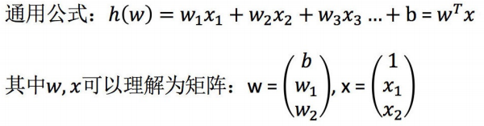

  线性回归的分类：线性关系和非线性关系 

  线性回归API：sklearn.linear_model.LinearRegression() LinearRegression.coef_：回归系数

  损失函数：最小二乘法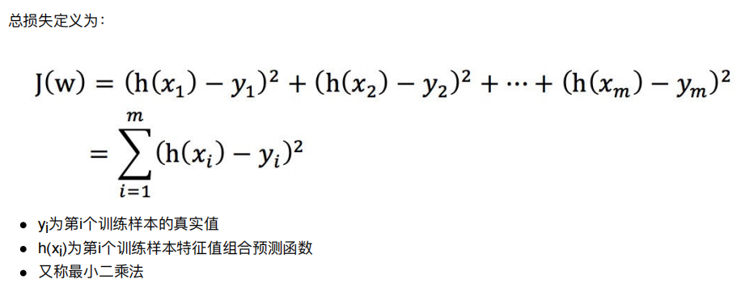

  线性回归优化方法

  * 正规方程：sklearn.linear_model.LinearRegression()

    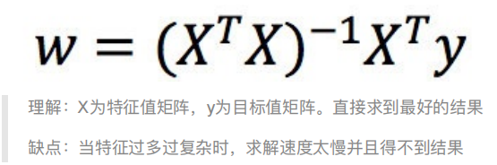

    一蹴而就，利用矩阵的逆,转置进行下一步求解 只是适合样本和特征比较少的情况

  * 梯度下降法：sklearn.linear_model.SGDRegressor(）

    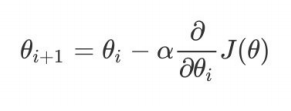

    梯度的概念：单变量 -- 切线，多变量 -- 向量；梯度下降法中关注的两个参数 α -- 就是步长，步长太小 -- 下山太慢，步长太大 -- 容易跳过极小值点；为什么梯度要加一个负号：梯度方向是上升最快方向,负号就是下降最快方向

    全梯度下降算法(FG)：在进行计算的时候,计算所有样本的误差平均值,作为我的目标函数

    随机梯度下降算法(SG)：每次只选择一个样本进行考核

    小批量梯度下降算法(mini-batch)：选择一部分样本进行考核

    随机平均梯度下降算法(SAG)：会给每个样本都维持一个平均值,后期计算的时候,参考这个平均值

  * 梯度下降法和正规方程选择依据：小规模数据： 正规方程LinearRegression(不能解决拟合问题)和岭回归，大规模数据： 梯度下降法：SGDRegressor

  欠拟合：在训练集上表现不好，在测试集上表现不好；解决方法： 继续学习1.添加其他特征项 2.添加多项式特征

  过拟合：在训练集上表现好，在测试集上表现不好；解决方法： 1.重新清洗数据集 2.增加数据的训练量 3.正则化 4.减少特征维度

  正则化：通过限制高次项的系数进行防止过拟合；L1正则化理解：直接把高次项前面的系数变为0，Lasso回归；L2正则化理解：把高次项前面的系数变成特别小的值，岭回归；

  Ridge Regression (岭回归，又名Tikhonov regularization)：岭回归是线性回归的正则化版本，即在原来的线性回归的 cost function 中添加正则项（regularization term）sklearn.linear_model.Ridge(alpha=1.0, fit_intercept=True,solver="auto", normalize=False)：具有l2正则化的线性回归，alpha -- 正则化，正则化力度越大，权重系数会越小，正则化力度越小，权重系数会越大，normalize 默认封装了，对数据进行标准化处理

  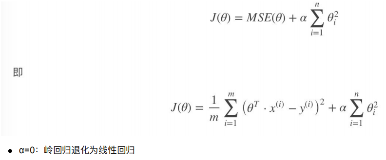

  Lasso Regression(Lasso 回归)：Lasso 回归是线性回归的另一种正则化版本，正则项为权值向量的ℓ1范数。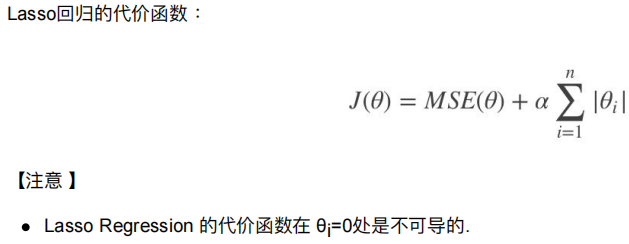

  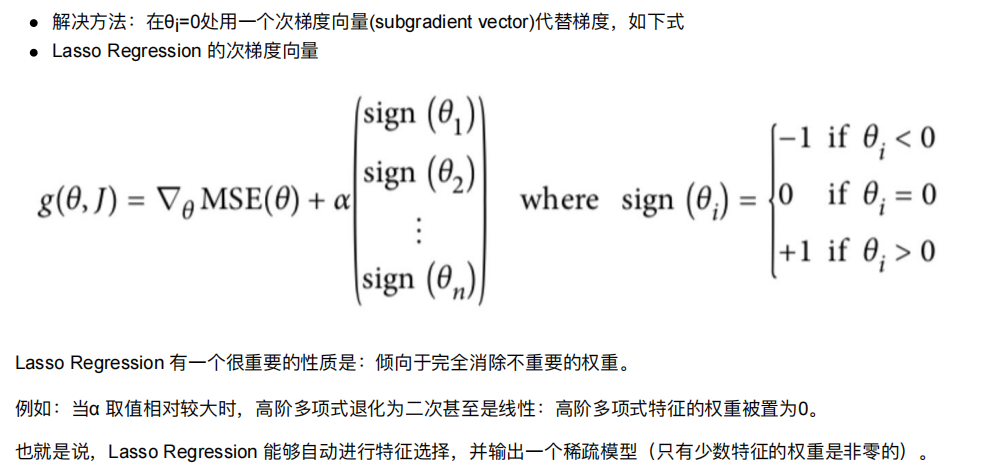

   Elastic Net (弹性网络)：弹性网络在岭回归和Lasso回归中进行了折中，通过 混合比(mix ratio) r 进行控制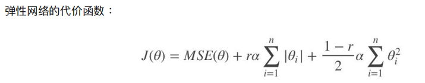

  Early Stopping：通过限制错误率的阈值，进行停止

  sklearn模型的保存和加载API：保存：joblib.dump(estimator, 'test.pkl')；加载：estimator = joblib.load('test.pkl') 注意：1.保存文件，后缀名是**.pkl 2.加载模型是需要通过一个变量进行承接

* 逻辑回归（Logistic Regression）：机器学习中的一种分类模型，逻辑回归是一种分类算法，虽然名字中带有回归，解决的是一个二分类问题，逻辑回归的输入是线性回归的输出

  逻辑回归的原理：输入：线性回归的输出，激活函数sigmoid函数把整体的值映射到[0,1]，再设置一个阈值，进行分类判断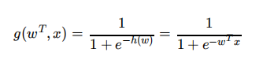

  逻辑回归的损失和优化：损失：对数似然损失，借助了log思想，进行完成，真实值等于0，等于1两种情况进行划分；优化：提升原本属于1类别的概率，降低原本是0类别的概率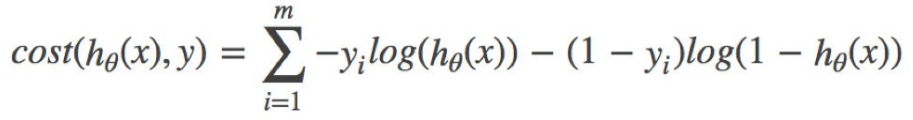

  sklearn.linear_model.LogisticRegression(solver='liblinear', penalty=‘l2’, C = 1.0) solver可选参数:{'liblinear', 'sag', 'saga','newton-cg', 'lbfgs'}， 默认: 'liblinear'，用于优化问题的算法，对于小数据集来说，“liblinear”是个不错的选择，而“sag”和'saga'对于大型数据集会更快，对于多类问题，只有'newton-cg'， 'sag'， 'saga'和'lbfgs'可以处理多项损失，“liblinear”仅限于“one-versus- rest”分类；penalty：正则化的种类；C：正则化力度；默认将类别数量少的当做正例；LogisticRegression方法相当于 SGDClassifier(loss="log", penalty=" "),SGDClassifier实现了一个普通的随机梯度下降学习，而使用LogisticRegression(实现了SAG)

  混淆矩阵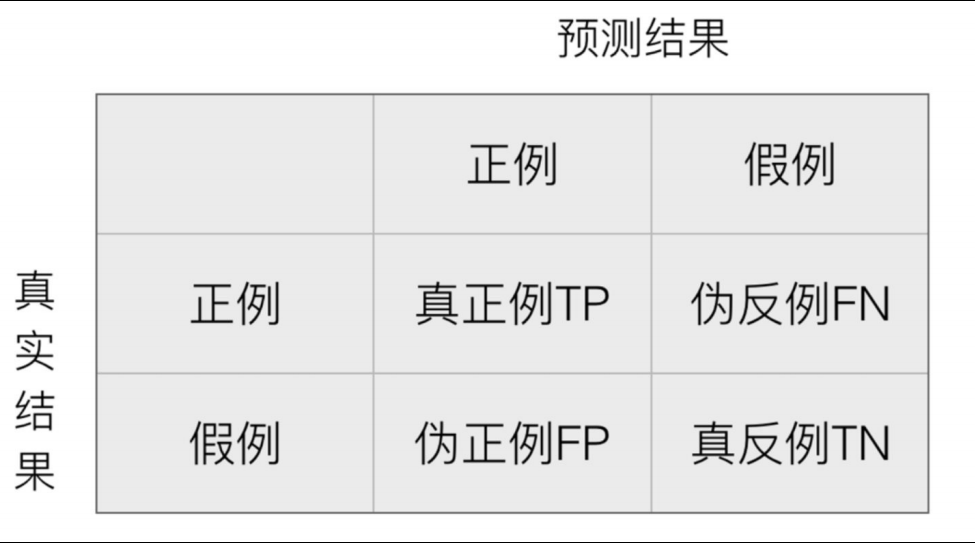

  精确率(Precision)与召回率(Recall):准确率：（对不对） （TP+TN）/(TP+TN+FN+FP)；精确率 -- 查的准不准 TP/(TP+FP)；召回率 -- 查的全不全 TP/(TP+FN)；F1-score反映模型的稳健性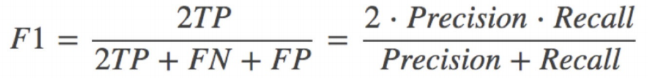

  分类评估报告api：sklearn.metrics.classification_report(y_true, y_pred, labels=[], target_names=None ) y_true：真实目标值；y_pred：估计器预测目标值；labels:指定类别对应的数字；target_names：目标类别名称；return：每个类别精确率与召回率

  roc曲线和auc指标：rROC曲线的横轴就是FPRate，纵轴就是TPRate（TPR=TP/(TP + FN) 所有真实类别为1的样本中，预测类别为1的比例，FPR=FP/(FP+TN) 所有真实类别为0的样本中，预测类别为1的比例），当两者相等时，表示的意义则是：对于不论真实类别是1还是0的样本，分类器预测为1的概率是相等的，此时AUC为0.5；AUC的概率意义是随机取一对正负样本，正样本得分大于负样本得分的概率；roc曲线通过tpr和fpr来进行图形绘制，然后绘制之后，行成一个指标auc，auc 越接近1，效果越好，越接近0，效果越差，越接近0.5，效果就是胡说。注意：这个指标主要用于评价不平衡的二分类问题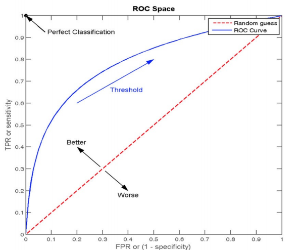

  AUC计算API：sklearn.metrics.roc_auc_score(y_true, y_score) 计算ROC曲线面积，即AUC值；y_true：每个样本的真实类别，必须为0(反例),1(正例)标记；y_score：预测得分，可以是正类的估计概率、置信值或者分类器方法的返回值

  ROC曲线的绘制：1.构建模型，把模型的概率值从大到小进行排序 2.从概率最大的点开始取值，一直进行tpr和fpr的计算，然后构建整体模型，得到结果 3.其实就是在求解积分（面积）

* 决策树：是一种树形结构，本质是一颗由多个判断节点组成的树

  常见决策树的启发函数比较

  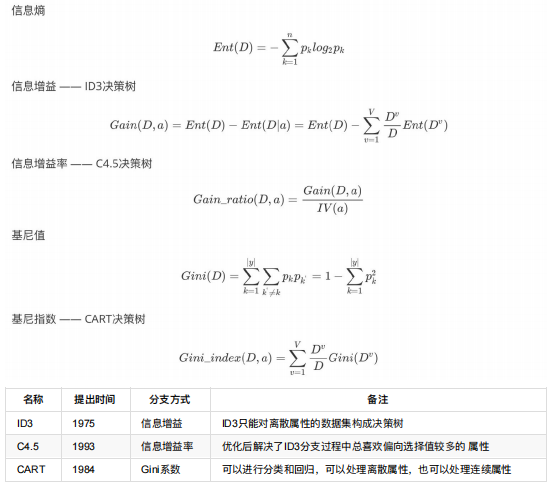

  ID3 算法存在的缺点： (1) ID3算法在选择根节点和各内部节点中的分支属性时，采用信息增益作为评价标准。信息增益的缺点是倾向于选择取值较多的属性，在有些情况下这类属性可能不会提供太多有价值的信息. (2) ID3算法只能对描述属性为离散型属性的数据集构造决策树

  C4.5算法做出的改进(为什么使用C4.5要好) (1) 用信息增益率来选择属性 (2) 可以处理连续数值型属性 (3)采用了一种后剪枝方法 (4)对于缺失值的处理；C4.5算法的优缺点，优点： 产生的分类规则易于理解，准确率较高；缺点： 在构造树的过程中，需要对数据集进行多次的顺序扫描和排序，因而导致算法的低效。 此外，C4.5只适合于能够驻留于内存的数据集，当训练集大得无法在内存容纳时程序无法运行。

  CART算法：CART算法相比C4.5算法的分类方法，采用了简化的二叉树模型，同时特征选择采用了近似的基尼系数来简化计算。 C4.5不一定是二叉树，但CART一定是二叉树。

  多变量决策树(multi-variate decision tree)：无论是ID3, C4.5还是CART,在做特征选择的时候都是选择最优的一个特征来做分类决策，但是大多数，分类决策不应该是由某一个特征决定的，而是应该由一组特征决定的。这样决策得到的决策树更加准确。这个决策树叫做多变量决策树(multi-variate decision tree)。在选择最优特征的时候，多变量决策树不是选择某一个最优特征，而是选择最优的一个特征线性组合来做决策。这个算法的代表是OC1，这里不多介绍。 如果样本发生一点点的改动，就会导致树结构的剧烈改变。这个可以通过集成学习里面的随机森林之类的方法解决

  决策树变量的两种类型： 1. 数字型（Numeric）：变量类型是整数或浮点数，用“>=”，“>”,“<”或“<=”作为分割条件 （排序后，利用已有的分割情况，可以优化分割算法的时间复杂度）；2. 名称型（Nominal）：类似编程语言中的枚举类型，变量只能从有限的选项中选取，使用“=”来分割。

  如何评估分割点的好坏：如果一个分割点可以将当前的所有节点分为两类，使得每一类都很“纯”，也就是同一类的记录较多，那么就是一个好分割点。构建决策树采用贪心算法，只考虑当前纯度差最大的情况作为分割点。

  剪枝原因：噪声、样本冲突，即错误的样本数据；特征即属性不能完全作为分类标准；巧合的规律性，数据量不够大。 常用剪枝方法：预剪枝是指在构建树的过程中同时剪枝：限制节点最小样本数，指定数据高度，指定熵值的最小值；后剪枝是指把一棵树，构建完成之后，再进行从下往上的剪枝

  特征提取：将任意数据（如文本或图像）转换为可用于机器学习的数字特征；特征提取分类：字典特征提取(特征离散化)，文本特征提取，图像特征提取；字典特征提取：字典特征提取就是对类别型数据进行转换，api:sklearn.feature_extraction.DictVectorizer(sparse=True,…) parse矩阵1.节省内容 2.提高读取效率，注意：对于特征当中存在类别信息的我们都会做one-hot编码处理；文本特征提取（英文）：api:sklearn.feature_extraction.text.CountVectorizer(stop_words=[]) stop_words -- 停用词 注意：没有sparse这个参数，单个字母，标点符号不做统计；文本特征提取（中文）：注意：1.在中文文本特征提取之前，需要对句字（文章）进行分词（jieba） 2.里面依旧可以使用停用词，进行词语的限制；tfidf：主要思想： 如果某个词或短语在一篇文章中出现的概率高，并且在其他文章中很少出现，则认为此词或者短语具有很好的类别区分能力，适合用来分类，tfidf tf -- 词频 idf -- 逆向文档频率 api:sklearn.feature_extraction.text.TfidfVectorizer 注意：分类机器学习算法进行文章分类中前期数据处理方式

  决策树算法api：class sklearn.tree.DecisionTreeClassifier(criterion=’gini’, max_depth=None,random_state=None) criterion：特征选择标准 "gini"或者"entropy"，前者代表基尼系数，后者代表信息增益，默认"gini"，即CART算法；min_samples_split：内部节点再划分所需最小样本数，这个值限制了子树继续划分的条件，如果某节点的样本数少于min_samples_split，则不会继续再尝试选择最优特征来进行划分，默认是2.如果样本量不大，不需要管这个值。如果样本量数量级非常大，则推荐增大这个值；min_samples_leaf：叶子节点最少样本数 这个值限制了叶子节点最少的样本数，如果某叶子节点数目小于样本数，则会和兄弟节点一起被剪枝，默认是1,可以输入最少的样本数的整数，或者最少样本数占样本总数的百分比，如果样本量不大，不需要管这个值。如果样本量数量级非常大，则推荐增大这个值；max_depth：决策树最大深度 决策树的最大深度，默认可以不输入，如果不输入的话，决策树在建立子树的时候不会限制子树的深度，一般来说，数据少或者特征少的时候可以不管这个值。如果模型样本量多，特征也多的情况下，推荐限制这个最大深度，具体的取值取决于数据的分布，常用的可以取值10-100之间；random_state：随机数种子

  关于数据类型，我们主要可以把其分为两类，连续型数据和离散型数据。在面对不同数据时，决策树也可以分为两种类型： 分类决策树和回归决策树。 前者主要用于处理离散型数据，后者主要用于处理连续型数据。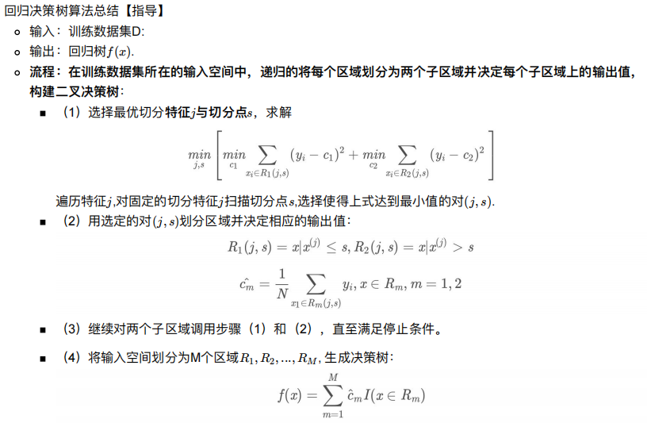

* 集成学习：通过建立几个模型来解决单一预测问题

  机器学习两个核心任务：1.解决欠拟合问题 弱弱组合变强 boosting 2.解决过拟合问题 互相遏制变壮 Bagging

  bagging集成过程：1.采样—从所有样本里面，采样一部分 2.学习—训练弱学习器 3.集成—使用平权投票

  随机森林定义：随机森林 = Bagging + 决策树；流程：1.随机选取m条数据 2.随机选取k个特征 3.训练决策树 4.重复1-3 5.对上面的弱决策树进行平权投票 注意：1.随机选取样本，且是有放回的抽取 2.选取特征的时候，选择m<<M M是所有的特征数；包外估计：如果进行有放回的对数据集抽样，会发现，总是有一部分样本选不到；api sklearn.ensemble.RandomForestClassifier()

  Bagging + 决策树/线性回归/逻辑回归/深度学习… = bagging集成学习方法

  bagging的优点：1.均可在原有算法上提高约2%左右的泛化正确率2.简单, 方便, 通用

  Boosting：随着学习的积累从弱到强，代表算法：Adaboost，GBDT，XGBoost，LightGBM

  bagging和boosting的区别：区别一:数据方面，Bagging对数据进行采样训练，Boosting根据前一轮学习结果调整数据的重要性；区别二:投票方面，Bagging所有学习器平权投票，Boosting对学习器进行加权投票；区别三:学习顺序Bagging的学习是并行的，每个学习器没有依赖关系，Boosting学习是串行，学习有先后顺序；区别四:主要作用，Bagging主要用于提高泛化性能（解决过拟合，也可以说降低方差），Boosting主要用于提高训练精度（解决欠拟合，也可以说降低偏差）

  AdaBoost构造过程：步骤一：初始化训练数据权重相等，训练第一个学习器；步骤二：AdaBoost反复学习基本分类器; 步骤三：对m个学习器进行加权投票

  GBDT 的全称是 Gradient Boosting Decision Tree，梯度提升树，在传统机器学习算法中，GBDT算的上TOP3的算法。首先，GBDT使用的决策树是CART回归树，为什么不用CART分类树呢？ 因为GBDT每次迭代要拟合的是梯度值，是连续值所以要用回归树

  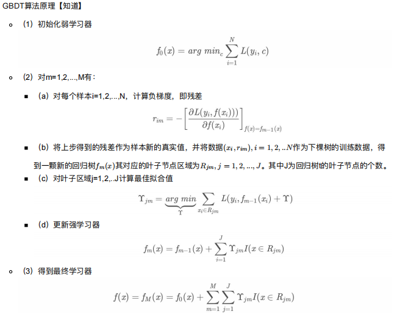

  XGBoost（Extreme Gradient Boosting）极端梯度提升树。XGBoost与GDBT的区别 区别一：XGBoost生成CART树考虑了树的复杂度，GDBT未考虑，GDBT在树的剪枝步骤中考虑了树的复杂度；区别二：XGBoost是拟合上一轮损失函数的二阶导展开，GDBT是拟合上一轮损失函数的一阶导展开，因此， XGBoost的准确性更高，且满足相同的训练效果，需要的迭代次数更少；区别三：XGBoost与GDBT都是逐次迭代来提高模型性能，但是XGBoost在选取最佳切分点时可以开启多线程进行，大大提高了运行速度。

  lightGBM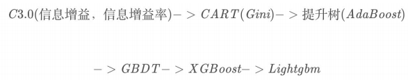

  lightGBM优势：基于Histogram（直方图）的决策树算法；Lightgbm的Histogram（直方图）做差加速；带深度限制的Leaf-wise的叶子生长策略；直接支持类别特征；直接支持高效并行；

* 聚类算法：一种典型的无监督学习算法， 主要用于将相似的样本自动归到一个类别中，计算样本和样本之间的相似性，一般使用欧式距离

  api：sklearn.cluster.KMeans(n_clusters=8)，参数:n_clusters:开始的聚类中心数量 方法：estimator.fit_predict(x)计算聚类中心并预测每个样本属于哪个类别,相当于先调用fit(x),然后再调用predict(x)

  K-means聚类实现流程：事先确定常数K，常数K意味着最终的聚类类别数，随机选定初始点为质心，并通过计算每一个样本与质心之间的相似度(这里为欧式距离)，将样本点归到最相似的类中， 接着，重新计算每个类的质心(即为类中心)，重复这样的过程，直到质心不再改变， 最终就确定了每个样本所属的类别以及每个类的质心。 注意:由于每次都要计算所有的样本与每一个质心之间的相似度，故在大规模的数据集上，K-Means算法的收敛速度比较慢。

  模型评估：误差平方和(SSE \The sum of squares due to error)误差平方和的值越小越好； “肘”方法 (Elbow method)下降率突然变缓时即认为是最佳的k值； 轮廓系数法（Silhouette Coefficient）取值为[-1, 1]，其值越大越好； CH系数（Calinski-Harabasz Index）分数s高则聚类效果越好，CH需要达到的目的：用尽量少的类别聚类尽量多的样本，同时获得较好的聚类效果。

  k-means算法优缺点总结：优点：1.原理简单（靠近中心点），实现容易 2.聚类效果中上（依赖K的选择） 3.空间复杂度o(N)，时间复杂度o(IKN)；缺点：1.对离群点、噪声敏感 （中心点易偏移） 2.很难发现大小差别很大的簇及进行增量计算 3.结果不一定是全局最优，只能保证局部最优（与K的个数及初值选取有关）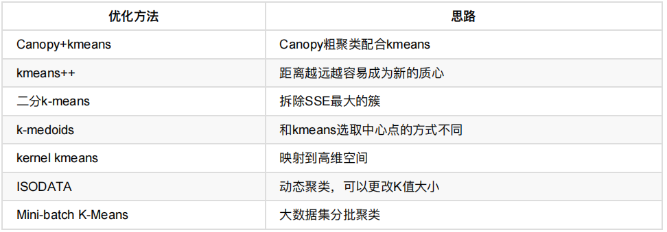

  降维：就是改变特征值，选择哪列保留，哪列删除，目标是得到一组”不相关“的主变量

  降维的两种方式：特征选择和主成分分析（可以理解一种特征提取的方式）

  * 特征选择：提出数据中的冗余变量 

    方法

    * Filter(过滤式)：主要探究特征本身特点、特征与特征和目标值之间关联 

      方差选择法：低方差特征过滤，把方差比较小的某一列进行剔除，api:sklearn.feature_selection.VarianceThreshold(threshold = 0.0) 删除所有低方差特征 注意，参数threshold一定要进行值的指定

      相关系数： 反映变量之间相关关系密切程度的统计指标，主要实现方式为皮尔逊相关系数和斯皮尔曼相关系数； 皮尔逊相关系数：通过具体值的大小进行计算，相对复杂 api:from scipy.stats import pearsonr 返回值，越接近|1|，相关性越强；越接近0，相关性越弱；斯皮尔曼相关系数：通过等级差进行计算，比上一个简单 api:from scipy.stats import spearmanr 返回值，越接近|1|，相关性越强；越接近0，相关性越弱

    * Embedded (嵌入式)：算法自动选择特征（特征与目标值之间的关联）

      * 决策树:信息熵、信息增益
      * 正则化：L1、L2

  * pca：高维数据转换为低维数据，然后产生了新的变量 api:sklearn.decomposition.PCA(n_components=None) n_components 整数 -- 表示降低到几维 小数 -- 保留百分之多少的信息

* 朴素贝叶斯：假定了特征与特征之间相互独立的贝叶斯公式

  API：sklearn.naive_bayes.MultinomialNB(alpha = 1.0) 朴素贝叶斯分类 alpha：拉普拉斯平滑系数

  朴素贝叶斯优缺点：优点：朴素贝叶斯模型发源于古典数学理论，有稳定的分类效率，对缺失数据不太敏感，算法也比较简单，常用于文本分类，分类准确度高，速度快；缺点：由于使用了样本属性独立性的假设，所以如果特征属性有关联时其效果不好，需要计算先验概率，而先验概率很多时候取决于假设，假设的模型可以有很多种，因此在某些时候会由于假设的先验模型的原因导致预测效果不佳；

  在估计条件概率P(X∣Y)时出现概率为0的情况怎么办？ 解决这一问题的方法是采用贝叶斯估计，简单来说，引入λ， 当λ=0时，就是普通的极大似然估计； 当λ=1时称为拉普拉斯平滑

  为什么属性独立性假设在实际情况中很难成立，但朴素贝叶斯仍能取得较好的效果？人们在使用分类器之前，首先做的第一步（也是最重要的一步）往往是特征选择，这个过程的目的就是为了排除特征之间的共线性、选择相对较为独立的特征； 对于分类任务来说，只要各类别的条件概率排序正确，无需精准概率值就可以得出正确分类； 如果属性间依赖对所有类别影响相同，或依赖关系的影响能相互抵消，则属性条件独立性假设在降低计算复杂度的同时不会对性能产生负面影响。

  朴素贝叶斯与LR的区别？

  * 朴素贝叶斯是生成模型， 根据已有样本进行贝叶斯估计学习出先验概率P(Y)和条件概率P(X|Y)， 进尔求出联合分布概率P(XY), 最后利用贝叶斯定理求解P(Y|X)，而LR是判别模型， 根据极大化对数似然函数直接求出条件概率P(Y|X)；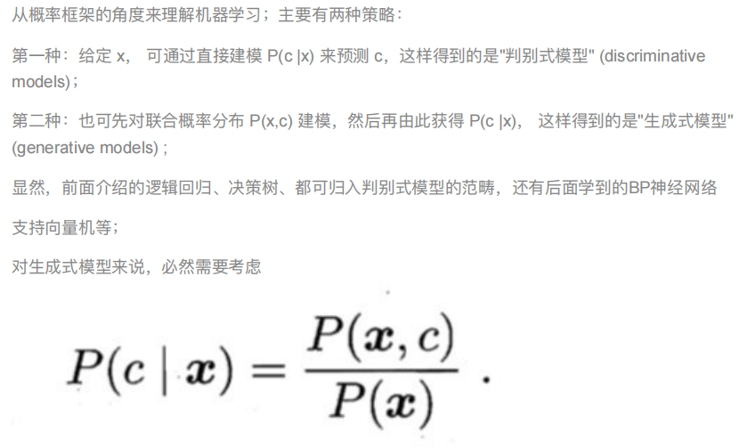
  * 朴素贝叶斯是基于很强的条件独立假设（在已知分类Y的条件下，各个特征变量取值是相互独立的），而LR则对此没有要求；
  * 朴素贝叶斯适用于数据集少的情景，而LR适用于大规模数据集。
  * 前者是生成式模型，后者是判别式模型，两者的区别就是生成式模型与判别式模型的区别。首先，Navie Bayes通过已知样本求得先验概率P(Y), 及条件概率P(X|Y), 对于给定的实例，计算联合概率，进而求出后验概率，也就是说，它尝试去找到底这个数据是怎么生成的（产生的），然后再进行分类，哪个类别最有可能产生这个信号，就属于那个类别。优点： 样本容量增加时，收敛更快，隐变量存在时也可适用；缺点：时间长，需要样本多，浪费计算资源；相比之下，Logistic回归不关心样本中类别的比例及类别下出现特征的概率，它直接给出预测模型的式子。设每个特征都有一个权重，训练样本数据更新权重w，得出最终表达式。 优点：直接预测往往准确率更高，简化问题，可以反应数据的分布情况，类别的差异特征，适用于较多类别的识别；缺点：收敛慢，不适用于有隐变量的情况。

* SVM：SVM全称是supported vector machine（支持向量机），即寻找到一个超平面使样本分成两类，并且间隔最大

  硬间隔和软间隔：硬间隔只有在数据是线性可分离的时候才有效，对异常值非常敏感；软间隔尽可能在保持最大间隔宽阔和限制间隔违例之间找到良好的平衡

  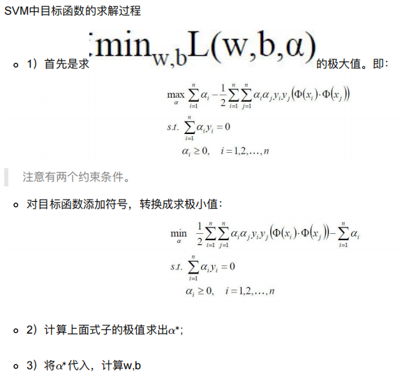

  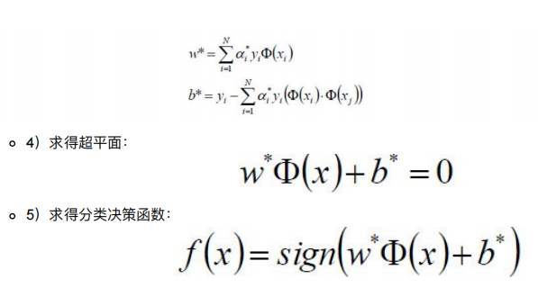

  SVM的损失函数：0/1损失函数 Hinge损失函数 Logistic损失函数

  SVM的核方法：将原始输入空间映射到新的特征空间，从而使得原本线性不可分的样本可能在核空间可分。 常见核函数：线性核 多项式核 RBF核 Sigmoid核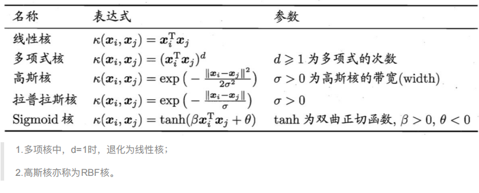

  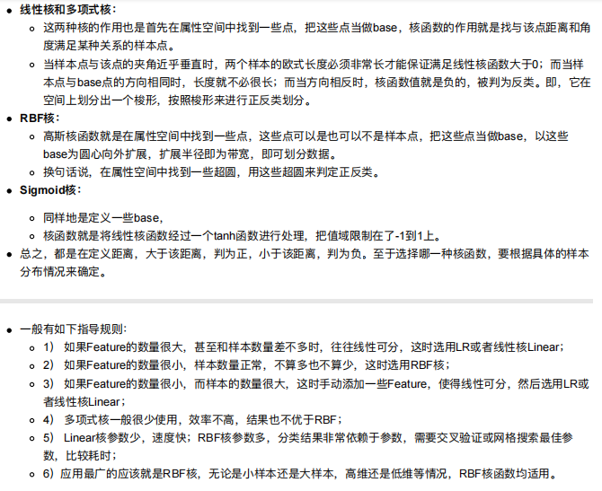

  SVM算法api：sklearn.svm.SVC sklearn.svm.NuSVC sklearn.svm.LinearSVC。SVC和NuSVC方法基本一致，唯一区别就是损失函数的度量方式不同，NuSVC中的nu参数和SVC中的C参数； LinearSVC是实现线性核函数的支持向量分类，没有kernel参数

  SVM基本综述：SVM是一种二类分类模型，它的基本模型是在特征空间中寻找间隔最大化的分离超平面的线性分类器。 1）当训练样本线性可分时，通过硬间隔最大化，学习一个线性分类器，即线性可分支持向量机； 2）当训练数据近似线性可分时，引入松弛变量，通过软间隔最大化，学习一个线性分类器，即线性支持向量 机；3）当训练数据线性不可分时，通过使用核技巧及软间隔最大化，学习非线性支持向量机。 

  SVM优缺点： SVM的优点： 在高维空间中非常高效，即使在数据维度比样本数量大的情况下仍然有效，在决策函数（称为支持向量）中使用训练集的子集，因此它也是高效利用内存的，通用性：不同的核函数与特定的决策函数一一对应； SVM的缺点： 如果特征数量比样本数量大得多，在选择核函数时要避免过拟合，对缺失数据敏感，对于核函数的高维映射解释力不强

* EM算法：一种迭代优化策略，由于它的计算方法中每一次迭代都分两步：其中一个为期望步（E步），另一个为极大步（M步）

  EM算法基本流程：1） 初始化参数； 2） 计算分布； 3） 重新估计参数； 4） 重复1-3步，直到参数不发生变化为止。

  EM算法的实现思路：首先根据已经给出的观测数据，估计出模型参数的值，然后再依据上一步估计出的参数值估计缺失数据的值，再根据估计出的缺失数据加上之前已经观测到的数据重新再对参数值进行估计，然后反复迭代，直至最后收敛，迭代结束。

* 隐马尔可夫模型（Hidden Markov Model，HMM）是统计模型，它用来描述一个含有隐含未知参数的马尔可夫过程。常见术语：可见状态链 隐含状态链 转换概率 输出概率

  马尔科夫链即为状态空间中从一个状态到另一个状态转换的随机过程，该过程要求具备“无记忆”的性质： 下一状态的概率分布只能由当前状态决定，在时间序列中它前面的事件均与之无关。

  什么样的问题可以用HMM模型解决：基于序列的，比如时间序列；问题中包含两类数据，一类是可以观测到的观测序列；另一类是不能观察到的隐藏状态序列。 HMM模型的两个重要假设：齐次马尔科夫链假设 观测独立性假设；

  HMM模型的三个基本问题

  * 评估观察序列概率：已知模型和观测序列，求观测序列出现的概率—前向后向的概率计算

    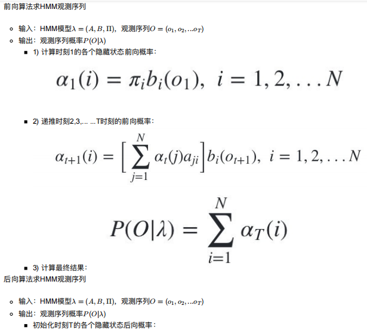

    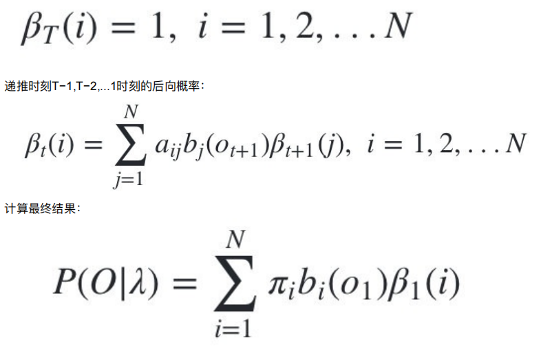

  * 预测问题，也称为解码问题：给定模型和观测序列，求给定观测序列条件下，最可能出现的对应的隐藏状态序列—维特比（Viterbi）算法

    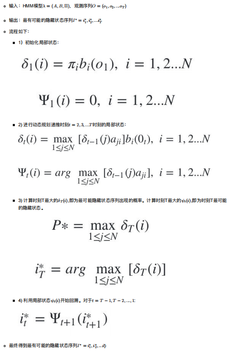

  * 模型参数学习问题：给定观测序列O = {o1, o2, ...oT }，估计模型λ = (A, B, Π)的参数，使该模型下观测序列的条件概率P(O∣λ)最大—鲍姆-韦尔奇（Baum-Welch）算法：基于EM算法的求解